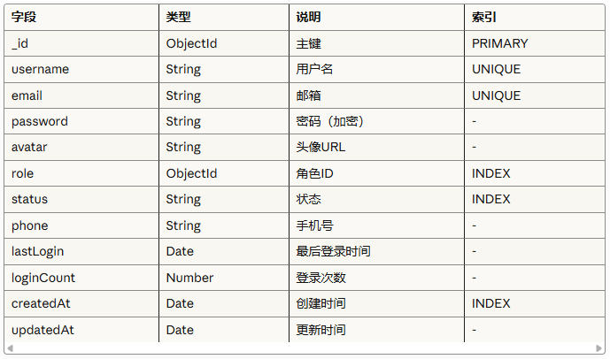
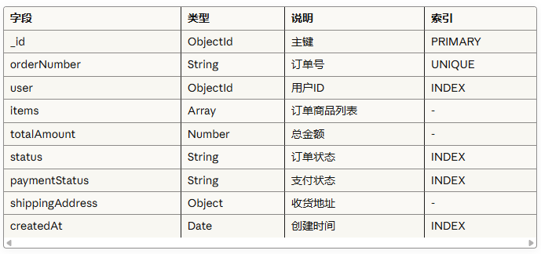

数据库设计文档
数据库信息

数据库类型: MongoDB
数据库名称: admin_system
字符集: UTF-8

集合（Collections）
1. users - 用户表

2. roles - 角色表

3. products - 商品表

4. orders - 订单表

索引设计
复合索引

用户查询: { email: 1, status: 1 }

商品查询: { category: 1, status: 1, price: 1 }

订单查询: { user: 1, status: 1, createdAt: -1 }

全文索引

商品搜索: { name: "text", description: "text" }
